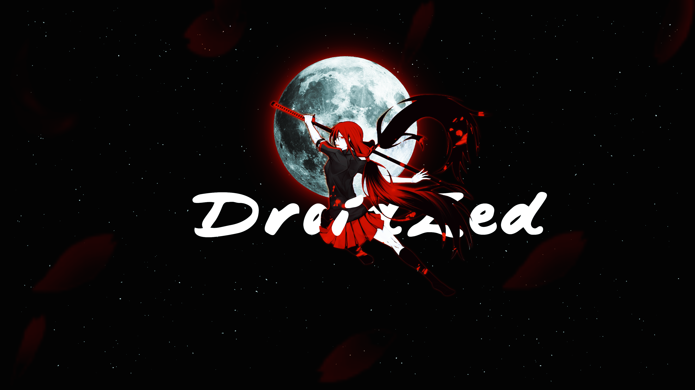

# 𝓓𝓻𝓸𝓲𝓭𝓩𝓮𝓭

>*_𝖂𝖊𝖑𝖈𝖔𝖒𝖊 𝖙𝖔 𝖒𝖞 𝖉𝖔𝖒𝖆𝖎𝖓_*

### 🎭 Frameworks / Libs:

| Tech | Logos  |
|:--|:--:
|🎨 **Web** |    |
|📱 **Mobile** |    |
| 👓 **Backend** |         |
| 💾 **Databases** |       |
| 🔨**Others** |    

### 📈 GitHub Stats:

<em> Thanks for visiting and have a good rest of your day 😁 </em>

<picture>
  <source media="(prefers-color-scheme: dark)" srcset="https://raw.githubusercontent.com/DroidZed/DroidZed/output/github-contribution-grid-snake-dark.svg" /> 
  <source media="(prefers-color-scheme: light)" srcset="https://raw.githubusercontent.com/DroidZed/DroidZed/output/github-contribution-grid-snake.svg" /> 
   
</picture>
